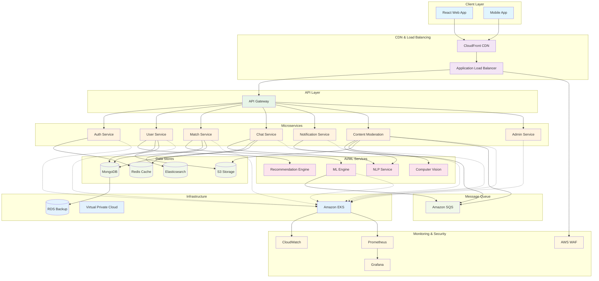

# System Architecture Diagram

This document provides a comprehensive overview of the Cloud AI Dating App's system architecture, including the microservices design, data flow, and infrastructure components.

## Overview

The Cloud AI Dating App is built using a modern microservices architecture deployed on AWS cloud infrastructure. The system is designed for scalability, reliability, and maintainability with clear separation of concerns across different services.

## Architecture Components

### Frontend Layer
- **React Web Application**: Single-page application built with React, TypeScript, and Tailwind CSS
- **Mobile App**: React Native application for iOS and Android (future implementation)
- **CDN**: CloudFront distribution for static asset delivery
- **Load Balancer**: Application Load Balancer for high availability

### Backend Services Layer
- **API Gateway**: Centralized entry point for all client requests
- **Authentication Service**: JWT-based authentication and authorization
- **User Service**: User profile management and preferences
- **Matching Service**: AI-powered matchmaking algorithms
- **Chat Service**: Real-time messaging with WebSocket support
- **Notification Service**: Push notifications and email alerts
- **Content Moderation Service**: AI-driven content filtering and safety
- **Admin Service**: Administrative dashboard and management tools

### Data Layer
- **Primary Database**: MongoDB for user data and profiles
- **Cache Layer**: Redis for session management and caching
- **Message Queue**: Amazon SQS for asynchronous processing
- **File Storage**: Amazon S3 for photos and media files
- **Search Engine**: Elasticsearch for advanced user discovery

### AI/ML Layer
- **Matching Engine**: Python-based ML service using TensorFlow/PyTorch
- **Recommendation System**: Collaborative filtering and content-based recommendations
- **Content Analysis**: NLP for profile text analysis and compatibility scoring
- **Image Recognition**: Computer vision for photo verification and analysis

### Infrastructure Layer
- **Container Orchestration**: Amazon EKS (Kubernetes)
- **Service Mesh**: Istio for service-to-service communication
- **Monitoring**: CloudWatch, Prometheus, and Grafana
- **Logging**: Centralized logging with ELK stack
- **Security**: WAF, VPC, security groups, and encryption

## System Architecture Diagram

## Data Flow Description

### 1. User Registration & Authentication
1. User submits registration form through React frontend
2. API Gateway routes request to Authentication Service
3. Auth Service validates data and creates user record in MongoDB
4. JWT tokens are generated and cached in Redis
5. Welcome email is queued through SQS to Notification Service

### 2. Profile Creation & Management
1. User completes profile through User Service
2. Photos are uploaded to S3 with signed URLs
3. Profile data is stored in MongoDB
4. Profile text is analyzed by NLP Service for interests extraction
5. Profile is indexed in Elasticsearch for search capabilities

### 3. Matchmaking Process
1. User preferences trigger Matching Service
2. ML Engine analyzes compatibility using collaborative filtering
3. Candidate profiles are retrieved from Elasticsearch
4. Compatibility scores are calculated and cached in Redis
5. Recommendations are returned to the frontend

### 4. Real-time Messaging
1. WebSocket connection established through Chat Service
2. Messages are validated by Content Moderation Service
3. Approved messages are stored in MongoDB
4. Real-time delivery via WebSocket to connected clients
5. Offline users receive push notifications via Notification Service

### 5. Content Moderation
1. All user-generated content passes through Moderation Service
2. Text content analyzed using NLP for inappropriate language
3. Images processed by Computer Vision for policy violations
4. Flagged content is queued for human review
5. Actions taken are logged and users notified if necessary

## Security Architecture

### Network Security
- **VPC Isolation**: All services deployed within private VPC subnets
- **Security Groups**: Restrictive firewall rules for each service
- **NAT Gateway**: Controlled internet access for private resources
- **AWS WAF**: Web application firewall protecting against common attacks

### Data Security
- **Encryption at Rest**: All data encrypted using AWS KMS
- **Encryption in Transit**: TLS 1.3 for all communications
- **Secrets Management**: AWS Secrets Manager for sensitive configuration
- **Data Backup**: Automated backups with point-in-time recovery

### Application Security
- **JWT Authentication**: Stateless token-based authentication
- **RBAC**: Role-based access control for admin functions
- **Rate Limiting**: API rate limiting to prevent abuse
- **Input Validation**: Comprehensive validation at all entry points

## Scalability Considerations

### Horizontal Scaling
- **Auto Scaling Groups**: Automatic scaling based on metrics
- **Container Orchestration**: Kubernetes for service scaling
- **Database Sharding**: MongoDB horizontal scaling strategy
- **CDN**: Global content delivery for static assets

### Performance Optimization
- **Caching Strategy**: Multi-layer caching with Redis
- **Database Indexing**: Optimized indexes for query performance
- **Connection Pooling**: Database connection optimization
- **Async Processing**: Message queues for non-blocking operations

## Disaster Recovery

### Backup Strategy
- **Database Backups**: Daily automated backups with 30-day retention
- **Code Repository**: Git-based version control with multiple remotes
- **Infrastructure as Code**: Terraform for reproducible deployments
- **Configuration Management**: Centralized configuration with versioning

### High Availability
- **Multi-AZ Deployment**: Services deployed across multiple availability zones
- **Health Checks**: Automated health monitoring and service recovery
- **Circuit Breakers**: Fault tolerance patterns for service resilience
- **Graceful Degradation**: Core functionality maintained during partial outages

## Future Enhancements

### Planned Features
- **Video Chat Integration**: WebRTC-based video calling
- **Advanced AI Features**: Personality analysis and compatibility prediction
- **Mobile Applications**: Native iOS and Android apps
- **Global Expansion**: Multi-region deployment for international users
- **Analytics Platform**: Advanced user behavior analytics

### Technical Improvements
- **Service Mesh Migration**: Complete Istio implementation
- **Event Sourcing**: CQRS pattern for better data consistency
- **GraphQL API**: Flexible query interface for clients
- **Machine Learning Pipeline**: MLOps for model deployment and monitoring
- **Observability**: Distributed tracing with Jaeger

## References

- [AWS Well-Architected Framework](https://aws.amazon.com/architecture/well-architected/)
- [Microservices Architecture Patterns](https://microservices.io/patterns/)
- [Cloud Native Computing Foundation](https://www.cncf.io/)
- [Kubernetes Best Practices](https://kubernetes.io/docs/concepts/)
- [MongoDB Scaling Guide](https://docs.mongodb.com/manual/sharding/)

---

**Note**: This architecture diagram is a living document that will be updated as the system evolves. For the most current implementation details, please refer to the individual service documentation and deployment configurations.
